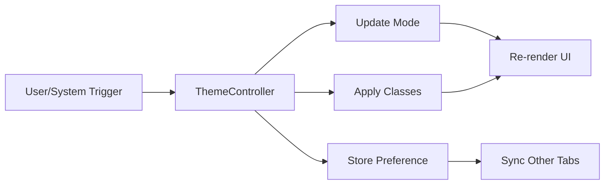
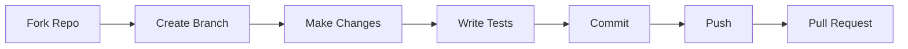

<div align="center">

# 🎨 Modern Dashboard Application

### A Comprehensive React Dashboard with Advanced Theme Management

[](https://reactjs.org/)
[](https://vitejs.dev/)
[](https://tailwindcss.com/)
[](LICENSE)


### 🚀 [Live Demo](https://your-demo-link.com) • 📖 [Documentation](https://your-docs-link.com) • 🐛 [Report Bug](https://github.com/AunMohammad254/frontend/issues)

</div>

---

## ✨ Features at a Glance

<table>
<tr>
<td width="50%">

### 🎯 **Core Features**
- ⚡ Lightning-fast React + Vite setup
- 🎨 Advanced Theme System (Light/Dark/System)
- 📊 Interactive Dashboard with Real-time Charts
- 📱 Fully Responsive Design
- ♿ WCAG 2.1 Accessibility Compliant
- 🔄 Cross-tab Theme Synchronization

</td>
<td width="50%">

### 🛠️ **Technical Stack**
- ⚛️ React 18.3+ with Hooks
- ⚡ Vite for Fast Development
- 🎨 Tailwind CSS 4.0
- 📈 Recharts for Data Visualization
- 🧩 Radix UI Components
- 🎭 Tabler Icons

</td>
</tr>
</table>

---

## 📸 Screenshots

<div align="center">

### Dashboard Overview


<table>
<tr>
<td></td>
<td></td>
</tr>
<tr>
<td align="center"><b>☀️ Light Theme</b></td>
<td align="center"><b>🌙 Dark Theme</b></td>
</tr>
</table>

</div>

---

## 🚀 Quick Start

### Prerequisites

```bash
Node.js >= 18.0.0
npm >= 9.0.0 or yarn >= 1.22.0
```

### Installation

```bash
# Clone the repository
git clone https://github.com/AunMohammad254/frontend.git

# Navigate to project directory
cd frontend

# Install dependencies
npm install

# Start development server
npm run dev
```

### 🎉 Your app is now running at [http://localhost:5173](http://localhost:5173)

---

## 📦 Available Scripts

| Command | Description |
|---------|-------------|
| `npm run dev` | 🚀 Start development server with HMR |
| `npm run build` | 🏗️ Build for production |
| `npm run preview` | 👀 Preview production build |
| `npm run lint` | 🔍 Run ESLint checks |

---

---

## 🎨 Advanced Theme System

<div align="center">

### 🌓 Intelligent Theme Detection & Management

</div>

Our theme system provides seamless integration between system preferences and user choices, with real-time synchronization across all browser tabs.

### 🏗️ Architecture Overview

```
┌─────────────────────────────────────────────────────────────┐
│                    ThemeController                          │
│  ┌──────────────┐  ┌──────────────┐  ┌─────────────────┐  │
│  │   Detect     │→ │   Apply      │→ │   Persist       │  │
│  │   System     │  │   Classes    │  │   localStorage  │  │
│  └──────────────┘  └──────────────┘  └─────────────────┘  │
└─────────────────────────────────────────────────────────────┘
          ↓                    ↓                    ↓
    ┌─────────┐          ┌─────────┐         ┌──────────┐
    │ OS Hook │          │   CSS   │         │  Sync    │
    │ Events  │          │ Variables│         │  Tabs    │
    └─────────┘          └─────────┘         └──────────┘
```

### 📁 Key Components

<table>
<tr>
<th>Component</th>
<th>Purpose</th>
<th>Location</th>
</tr>
<tr>
<td><code>ThemeController</code></td>
<td>Central theme management logic</td>
<td><code>src/lib/theme-controller.js</code></td>
</tr>
<tr>
<td><code>useTheme()</code></td>
<td>React hook for theme access</td>
<td><code>src/hooks/use-theme.js</code></td>
</tr>
<tr>
<td>CSS Variables</td>
<td>Color system definitions</td>
<td><code>src/index.css</code></td>
</tr>
</table>

### 🔄 Theme Change Flow



### 💡 Features

<table>
<tr>
<td>

#### ✅ Detection & Fallbacks
- 🔍 Uses `matchMedia('prefers-color-scheme')`
- 🔄 Real-time OS theme change detection
- 🛡️ Graceful fallback to light theme
- 🖥️ Safari & legacy browser support

</td>
<td>

#### 🎯 Theme Management
- 🌞 Light Mode
- 🌙 Dark Mode
- 💻 System Auto-detection
- 🎨 Smooth CSS transitions
- ⚡ <200ms toggle performance

</td>
</tr>
</table>

### 🎨 Color System

```css
/* Light Theme Variables */
--background: oklch(98% 0 0)
--foreground: oklch(20% 0 0)
--primary: oklch(55% 0.18 260)

/* Dark Theme Variables */
--background: oklch(15% 0 0)
--foreground: oklch(95% 0 0)
--primary: oklch(65% 0.16 260)
```

### ♿ WCAG 2.1 Compliance

- ✅ **4.5:1** contrast ratio for normal text
- ✅ **3:1** contrast ratio for large text & UI components
- ✅ Validated with axe-core and Lighthouse
- ✅ Screen reader compatible

### 💾 Persistence & Synchronization

```javascript
// Stored in localStorage
{
  "app.theme.v2": {
    "mode": "dark",      // "light" | "dark" | "system"
    "version": 2
  }
}
```

**Cross-tab Sync:** Changes propagate instantly across all open tabs via `storage` events.

---

---

## 📊 Dashboard Components

### 🎯 Section Cards
<details>
<summary><b>📈 Real-time Statistics Display</b></summary>

```javascript
// Four key metrics displayed in a responsive grid
- Total Revenue: $1,250.00 (+12.5%)
- New Customers: 1,234 (-20%)
- Active Accounts: 45,678 (+12.5%)
- Growth Rate: 4.5% (+4.5%)
```

**Features:**
- ✨ Gradient backgrounds
- 📊 Trend indicators (up/down)
- 📱 Responsive grid (1-2-4 columns)
- 🎨 Theme-aware styling

</details>

### 📉 Interactive Area Chart
<details>
<summary><b>📊 Visitor Analytics Visualization</b></summary>

**Powered by Recharts:**
- 📅 Time-based data visualization
- 🖱️ Hover tooltips for detailed info
- 🔄 Multiple data series (Desktop/Mobile)
- 📱 Responsive time range selection
- ⚡ Smooth animations

</details>

### 📋 Advanced Data Table
<details>
<summary><b>🗂️ Document Management System</b></summary>

**Features:**
- 🔍 Advanced filtering & sorting
- 🎯 Column visibility controls
- 📄 Pagination with customizable page size
- 🎨 Multiple view modes (Outline, Compact, Dense)
- ✏️ Inline editing with drawer
- 🔄 Drag-and-drop row reordering
- 📊 Status badges (Done, In Progress)
- 👤 Reviewer assignment

</details>

---

## 🎯 Usage Examples

### Using the Theme Hook

```jsx
import { useTheme } from '@/hooks/use-theme'

function MyComponent() {
  const { mode, effective, setTheme } = useTheme()
  
  return (
    <div>
      <p>Current mode: {mode}</p>
      <p>Effective theme: {effective}</p>
      <button onClick={() => setTheme('dark')}>Dark Mode</button>
      <button onClick={() => setTheme('light')}>Light Mode</button>
      <button onClick={() => setTheme('system')}>System</button>
    </div>
  )
}
```

### Creating Theme-Aware Components

```jsx
import { Card } from '@/components/ui/card'

function ThemeAwareCard() {
  return (
    <Card className="bg-card text-card-foreground border-border">
      {/* Content automatically adapts to theme */}
      <h2 className="text-foreground">Title</h2>
      <p className="text-muted-foreground">Description</p>
    </Card>
  )
}
```

### Using Themed Assets

```javascript
import { resolveThemedAsset } from '@/lib/theme-controller'

const logo = resolveThemedAsset({
  light: '/assets/logo-light.svg',
  dark: '/assets/logo-dark.svg'
})
```

---

## 🛠️ Development Guidelines

### 📐 Code Structure

```
src/
├── app/
│   └── dashboard/         # Dashboard-specific data
├── assets/                # Static assets (images, icons)
├── components/
│   ├── ui/                # Reusable UI primitives
│   ├── app-sidebar.jsx    # Navigation sidebar
│   ├── chart-*.jsx        # Chart components
│   ├── data-table.jsx     # Table component
│   └── section-cards.jsx  # Stats cards
├── hooks/
│   ├── use-theme.js       # Theme management hook
│   └── use-mobile.js      # Responsive breakpoint hook
├── lib/
│   ├── theme-controller.js # Core theme logic
│   └── utils.js           # Utility functions
├── App.jsx                # Main application
├── main.jsx               # Application entry
└── index.css              # Global styles & theme variables
```

### 🎨 Styling Conventions

```css
/* ✅ DO: Use CSS variables */
.my-component {
  background: var(--background);
  color: var(--foreground);
}

/* ❌ DON'T: Use hardcoded colors */
.my-component {
  background: #ffffff;
  color: #000000;
}
```

### 🔧 Adding New Components

1. **Create Component File**
   ```bash
   touch src/components/my-component.jsx
   ```

2. **Use Theme Variables**
   ```jsx
   export function MyComponent() {
     return (
       <div className="bg-card text-card-foreground p-4 rounded-lg">
         {/* Your content */}
       </div>
     )
   }
   ```

3. **Wrap in ErrorBoundary**
   ```jsx
   <ErrorBoundary>
     <MyComponent />
   </ErrorBoundary>
   ```

4. **Test Both Themes**
   - Toggle between light/dark modes
   - Verify contrast ratios
   - Check responsive behavior

---

## 🧪 Testing & Quality Assurance

### 🎯 Testing Matrix

| Category | Tools | Status |
|----------|-------|--------|
| **Unit Tests** | Vitest, React Testing Library | ⏳ Planned |
| **E2E Tests** | Playwright | ⏳ Planned |
| **Visual Regression** | Percy/Chromatic | ⏳ Planned |
| **Accessibility** | axe-core, Lighthouse | ✅ Passing |
| **Performance** | Lighthouse, WebPageTest | ✅ Optimized |

### 🔍 Manual Testing Checklist

- [ ] Theme switching (Light/Dark/System)
- [ ] Cross-tab theme synchronization
- [ ] Responsive layout (Mobile/Tablet/Desktop)
- [ ] Chart interactions (hover, tooltips)
- [ ] Data table (sort, filter, pagination)
- [ ] Sidebar collapse/expand
- [ ] Keyboard navigation
- [ ] Screen reader compatibility

### 📊 Performance Targets

- ⚡ **First Contentful Paint:** < 1.5s
- 🎨 **Largest Contentful Paint:** < 2.5s
- ⏱️ **Time to Interactive:** < 3.5s
- 🔄 **Theme Toggle:** < 200ms
- 📦 **Bundle Size:** < 250KB (gzipped)

---

## 🐛 Troubleshooting

<details>
<summary><b>Theme not switching properly</b></summary>

1. Check browser console for errors
2. Verify `localStorage` key `app.theme.v2`
3. Inspect `document.documentElement.classList` for `.dark`
4. Clear cache and reload

```bash
# Clear development cache
npm run dev -- --force
```

</details>

<details>
<summary><b>Components not rendering</b></summary>

1. Check ErrorBoundary is wrapping components
2. Verify all imports are correct
3. Check for prop type mismatches
4. Review browser console for errors

```bash
# Run lint to catch issues
npm run lint
```

</details>

<details>
<summary><b>Build fails</b></summary>

1. Clear node_modules and reinstall
   ```bash
   rm -rf node_modules package-lock.json
   npm install
   ```

2. Check Node.js version
   ```bash
   node --version  # Should be >= 18.0.0
   ```

3. Verify all dependencies are compatible
   ```bash
   npm outdated
   ```

</details>

---

## 🚢 Deployment

### 📦 Build for Production

```bash
# Create optimized production build
npm run build

# Preview production build locally
npm run preview
```

### ☁️ Deploy to Platforms

<table>
<tr>
<td align="center" width="33%">

#### Vercel
```bash
npm i -g vercel
vercel
```

</td>
<td align="center" width="33%">

#### Netlify
```bash
npm i -g netlify-cli
netlify deploy
```

</td>
<td align="center" width="33%">

#### GitHub Pages
```bash
npm run build
gh-pages -d dist
```

</td>
</tr>
</table>

### 🌐 Environment Variables

Create a `.env` file for environment-specific configuration:

```env
VITE_APP_TITLE=Modern Dashboard
VITE_API_URL=https://api.example.com
VITE_ENABLE_ANALYTICS=true
```

---

## 🤝 Contributing

We welcome contributions! Please follow these guidelines:

### 📋 Contribution Workflow



### 🔀 Steps to Contribute

1. **Fork the repository**
   ```bash
   gh repo fork AunMohammad254/frontend
   ```

2. **Create a feature branch**
   ```bash
   git checkout -b feature/amazing-feature
   ```

3. **Make your changes**
   - Follow code style guidelines
   - Test both light and dark themes
   - Ensure accessibility standards

4. **Commit your changes**
   ```bash
   git commit -m "✨ feat: Add amazing feature"
   ```

5. **Push to your fork**
   ```bash
   git push origin feature/amazing-feature
   ```

6. **Open a Pull Request**
   - Provide clear description
   - Reference any related issues
   - Include screenshots if UI changes

### 📝 Commit Convention

We follow [Conventional Commits](https://www.conventionalcommits.org/):

```
✨ feat: Add new feature
🐛 fix: Fix bug
📚 docs: Update documentation
💄 style: Improve UI/styling
♻️ refactor: Code refactoring
⚡ perf: Performance improvement
✅ test: Add/update tests
🔧 chore: Maintenance tasks
```

---

## 📄 License

This project is licensed under the **MIT License** - see the [LICENSE](LICENSE) file for details.

```
MIT License

Copyright (c) 2025 AunMohammad254

Permission is hereby granted, free of charge, to any person obtaining a copy
of this software and associated documentation files (the "Software"), to deal
in the Software without restriction, including without limitation the rights
to use, copy, modify, merge, publish, distribute, sublicense, and/or sell
copies of the Software, and to permit persons to whom the Software is
furnished to do so, subject to the following conditions:

The above copyright notice and this permission notice shall be included in all
copies or substantial portions of the Software.
```

---

## 🙏 Acknowledgments

### 💎 Built With

- **[React](https://reactjs.org/)** - UI Framework
- **[Vite](https://vitejs.dev/)** - Build Tool
- **[Tailwind CSS](https://tailwindcss.com/)** - Styling
- **[Radix UI](https://www.radix-ui.com/)** - Accessible Components
- **[Recharts](https://recharts.org/)** - Data Visualization
- **[Tabler Icons](https://tabler-icons.io/)** - Icon Library
- **[TanStack Table](https://tanstack.com/table/)** - Table Management

### 🌟 Special Thanks

- React Team for amazing hooks API
- Vite Team for blazing-fast development experience
- Tailwind Labs for the incredible CSS framework
- All open-source contributors

---

## 📞 Support & Contact

<div align="center">

### 💬 Get in Touch

[](https://github.com/AunMohammad254)
[](mailto:your.email@example.com)
[](https://linkedin.com/in/your-profile)

### ⭐ Star this project if you find it helpful!

[](https://github.com/AunMohammad254/frontend/stargazers)
[](https://github.com/AunMohammad254/frontend/network/members)
[](https://github.com/AunMohammad254/frontend/watchers)

</div>

---

## 🗺️ Roadmap

### 📅 Upcoming Features

- [ ] 🔐 User Authentication & Authorization
- [ ] 📱 Progressive Web App (PWA) Support
- [ ] 🌍 Internationalization (i18n)
- [ ] 📊 More Chart Types & Visualizations
- [ ] 🔔 Real-time Notifications
- [ ] 📤 Export Data (CSV, PDF, Excel)
- [ ] 🎨 Custom Theme Builder
- [ ] 📈 Advanced Analytics Dashboard
- [ ] 🔍 Global Search Functionality
- [ ] 💾 Offline Mode Support

### 🎯 Version History

- **v1.0.0** (Current) - Initial Release
  - ✅ Dashboard with stats cards
  - ✅ Interactive charts
  - ✅ Data table with advanced features
  - ✅ Advanced theme system
  - ✅ Responsive design
  - ✅ Accessibility compliance

---

## 📊 Project Statistics

<div align="center">


### 📈 Development Activity

```
Languages:
JavaScript   ████████████████████░   85%
CSS          ██████░░░░░░░░░░░░░░░   10%
HTML         ██░░░░░░░░░░░░░░░░░░░    3%
JSON         █░░░░░░░░░░░░░░░░░░░░    2%
```

</div>

---

<div align="center">

### 🎉 Thank you for checking out this project!


**Made with ❤️ by [AunMohammad254](https://github.com/AunMohammad254)**

<sub>Last Updated: November 2025</sub>

</div>
